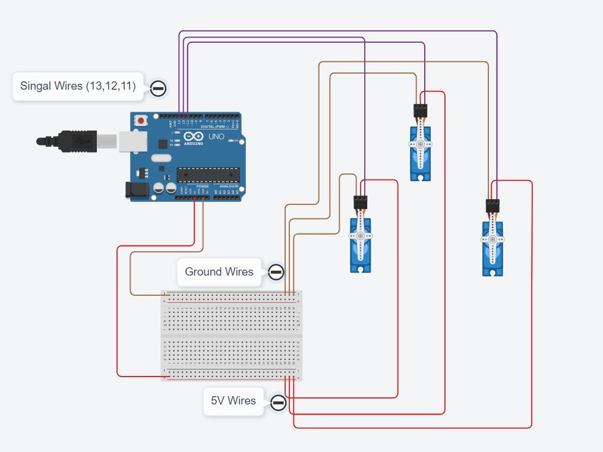
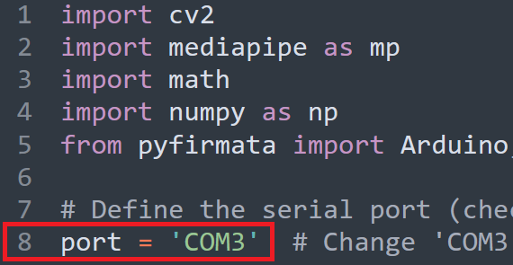
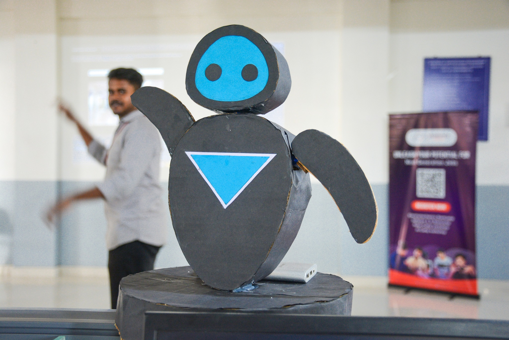
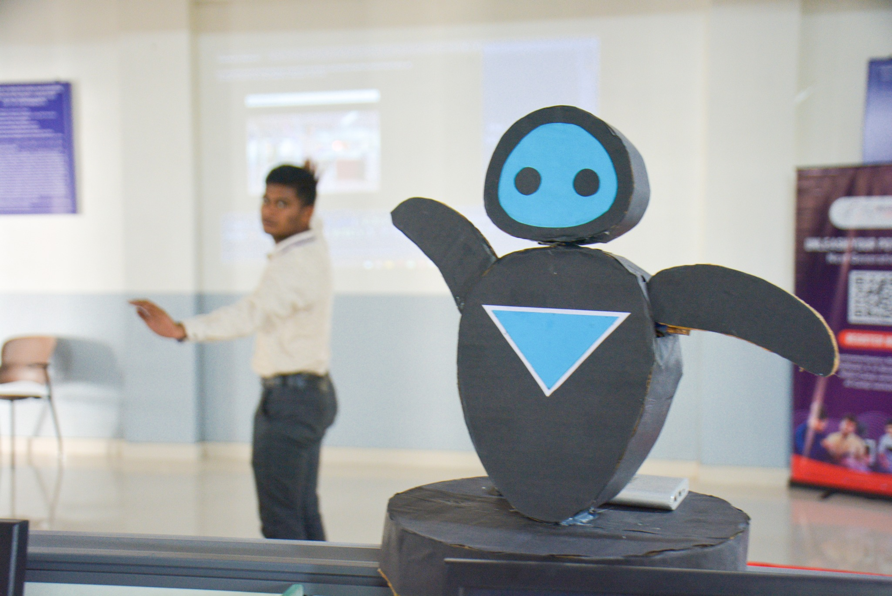
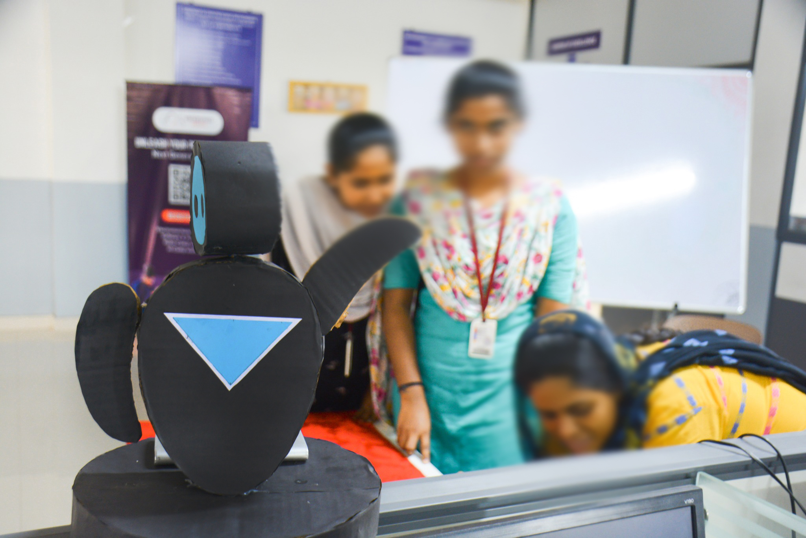

# MR.HUMANOID

## Repo Structure

```
    ├── docs                                   # Contains documents.
    ├── research                               # Contains pre-research experiments.
    │   ├── 0-code-references                      # Contains reference codes.
    │   ├── 1-web-based-prototype-v1.0.0           # Contains a web app trained using Teachable Machine.
    │   ├── 2-desktop-based-prototype-v1.0.0       # Contains py apps basic prototypes.
    ├── source                                 # Contains main source code.
    │   ├── 0-pose-based-main.py                   # pose-based version
    │   ├── 1-voice-based-main.py                  # voice-based version
    └── README.MD                              # Readme Content.

```

## 01 Introduction

It is a humanoid robot powered by Arduino and AI, responding to humans' poses and voice commands. This robot has two significant features: it can work with human postures, mimic arm movements, listen to humans, and move its arms and head according to voice inputs.


## 02 Technology Stack

### 2.1 Hardware Stack

- Arduino UNO (1)
- 180deg Micro Servo Motor (3)
- Full / Half Bread Board (1)
- Jumper Wires

### 2.2 Software Stack

- Python 3.8.5
- Arduino IDE (Framework)
- OpenCV
- Mediapipe 0.10.3
- PyFirmata
- SpeechRecognition
- PyAudio

## 03 Setup

### 3.1 Hardware Setup



| Objects       | Pin No  |
| ------------- | ------- |
| **Left Arm**  | Pin: 13 |
| **Right Arm** | Pin: 12 |
| **Head**      | Pin: 11 |

### 3.2 Firmware Setup

Setting up the Arduino firmware is necessary to enable communication between Python and Arduino. The Firmata protocol establishes serial communication between a Python script and an Arduino.

To upload Firmata, open Arduino IDE and choose the correct COM port and **File -> Examples -> Firmata -> StandardFirmata -> Upload to Arduino UNO Board**.


**Note:** After uploading StandardFirmata to the Arduino Board, Python can be used to program it.

### 3.3 Setup Software

We will now install the necessary software and configure the AI to gain access to the Arduino Board. This project utilizes essential libraries, including Speech Recognition, MediaPipe, and OpenCV. We need to install all the required dependencies on the development computer.

- **Step 01:** Install Python

  ```
  Ver: 3.8.5 is Recommended (www.python.org)
  ```

- **Step 02:** Navigate to the specified location in CMD/Terminal.

  ```
  mr-humanoid/docs/requirements.txt
  ```

- **Step 03:** Execute the given command to install all dependencies.

  ```
  pip install -r requirements.txt
  ```

## 04 Usage

We have two Python programs: **0-pose-based-main.py (Pose-based)** and **1-voice-based-main.py (Voice-based)**:

- **Pose-based:** This program utilizes OpenCV and MediaPipe to track and mimic the movement of a human arm.

- **Voice-based:** This program utilizes Speech Recognition technology to listen to human voices and carry out instructions.

- **Source Directory:**

  ```
  mr-humanoid\source

      * 0-pose-based-main.py
      * 1-voice-based-main.py
  ```

### 4.1 Setps to run

- **Step 01:** Connect the Arduino to the development computer.

- **Step 02:** Modify the script to reflect the appropriate COM port.

  

- **Step 03:** To run the Pose-based app.

  ```
  python 0-pose-based-main.py
  ```

- **Step 04:** To run the Voice-based app.

  ```
  python 1-voice-based-main.py
  ```

### 4.2 Output








### 4.3 Voice Commands

| Voice Commands      |
| ------------------- |
| **right hand up**   |
| **left hand up**    |
| **right hand down** |
| **left hand down**  |
| **hands up**        |
| **hands down**      |
| **head left**       |
| **head right**      |
| **head forward**    |

# Contact

### Website: 

[](https://www.gunarakulan.info)

### Social Media:

[](https://www.linkedin.com/in/gunarakulangunaretnam)
[](https://www.facebook.com/gunarakulangunaretnam)
[](https://wa.me/94740001141?text=WhatsApp%3A%20%2B9740001141)
[](https://www.instagram.com/gunarakulangunaretnam)
[](https://x.com/gunarakulangr)
[](https://www.kaggle.com/gunarakulangr)
[](https://www.tiktok.com/@gunarakulangunaretnam)
[](https://www.youtube.com/channel/UCjMOdgHFAjAdBKiqV8y2Tww)
